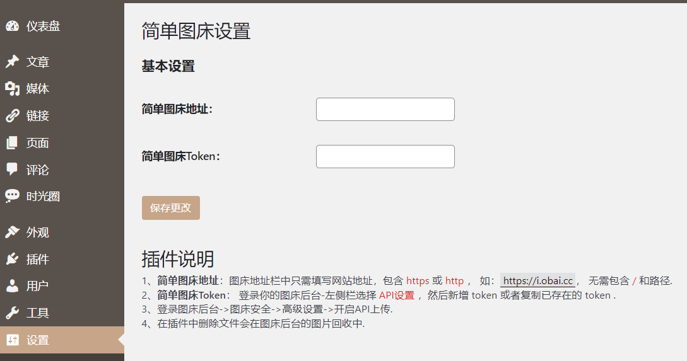
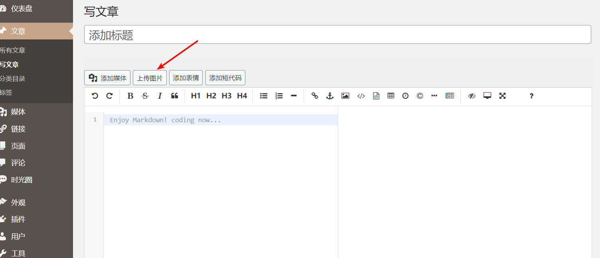
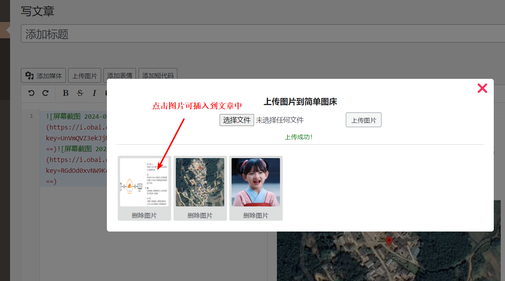
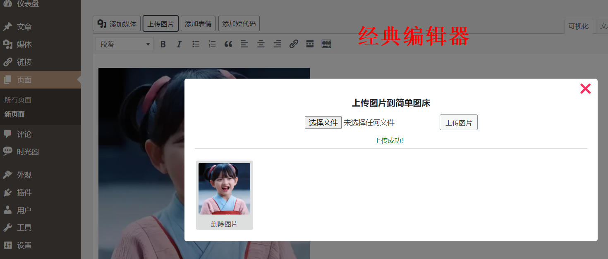

# WordPress 上图图片到简单图床插件

1. 图床地址栏中只需填写网站地址，包含 `https` 或 `http` ， 如： `https://i.obai.cc `， 无需包含 / 和路径.
2. 登录你的图床后台-左侧栏选择  `API设置` ，然后新增 token 或者复制已存在的 token .
3. 登录图床后台->图床安全->高级设置->开启API上传.
4. 在插件中删除文件会在图床后台的图片回收中.
5. **古腾堡编辑器**下不支持使用，只能用于经典编辑器或markdown编辑器下.
6. 图片上传后需要点击图片才能插入到文章中，本来是自动插入但是我给去除了.

> 第一次写WordPress插件，还有很多不足的地方，希望各位大佬们帮忙优化优化🙈.

